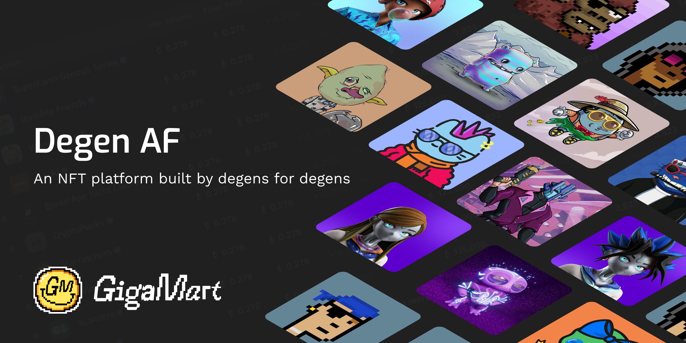

# GigaMart

Here you will find the contracts that we have so lovingly worked on to bring you [GigaMart](https://gigamart.com), an new NFT platform built by degens for degens.

Here are the production contracts:

<table>
<tr>
<th>Name</th>
<th>Address</th>
</tr>

<tr>
<td>GigaMart</td>
<td >
[0xcA833F943a0C7D3C4021B0b161a2686f9ebf6b02](https://etherscan.io/address/0xca833f943a0c7d3c4021b0b161a2686f9ebf6b02)
</td>
</tr>

<tr>
<td>Platform Fee Timelock</td>
<td >
[0x31f199C8107b6E5F055D332B501e8f2f36c61EE0](https://etherscan.io/address/0x31f199C8107b6E5F055D332B501e8f2f36c61EE0)
</td>
</tr>

<tr>
<td>GigaMart Proxy Registry</td>
<td >
[0x72939b9d6fe467d58D9b6cd35F35FA7DE9383D01](https://etherscan.io/address/0x72939b9d6fe467d58D9b6cd35F35FA7DE9383D01)
</td>
</tr>

<tr>
<td>GigaMart Token Transfer Proxy</td>
<td >
[0x2f0809Aa3f09b19d5e8CD869108427032683e901](https://etherscan.io/address/0x2f0809Aa3f09b19d5e8CD869108427032683e901)
</td>
</tr>

<tr>
<td>GigaMart Aggregator</td>
<td >
[0x4C9712Cd94376C537464cAa4d87bce198d59936c](https://etherscan.io/address/0x4C9712Cd94376C537464cAa4d87bce198d59936c)
</td>
</tr>

</table>

## Trust Model

The irony of discussing a trust model for a product built on Ethereum, with which we can achieve full trustlessness, is not lost on us. We are decentralization maxis who believe in building a truly open marketplace. We do however want to be completely candid with you that GigaMart is not yet as trustless as we want it to be. We have ideas on how to reach full trustlessness; now that the project is live we'll be rapidly iterating to get there. For the time being there exists the following points of centralization, each of which have been carefully considered against the product features they enable:

0. The order book is not immediately public.

Why we think this is justified: this is a common factor across most marketplaces. It's a high priority of ours to share our orders through a public API, but we can do better.

1. The configuration of all royalties requires a message signed by our centralized validator. This gives us full control over setting collection royalties.

Why we think this is justified: for years royalties on marketplaces were a 100% centralized off-chain construct. We currently offer a gas-optimized middle ground where royalty fees are paid out directly to collection owners while still allowing an arbitrary number of collection administrators to manage their collections.

2. The configuration of platform fees is in the hands of a centralized manager, and platform fee changes retroactively impact orders.

We have mitigated the risk of impacting existing orders by placing control of platform fee configuration behind a timelock contract [here](https://etherscan.io/address/0x31f199c8107b6e5f055d332b501e8f2f36c61ee0).
